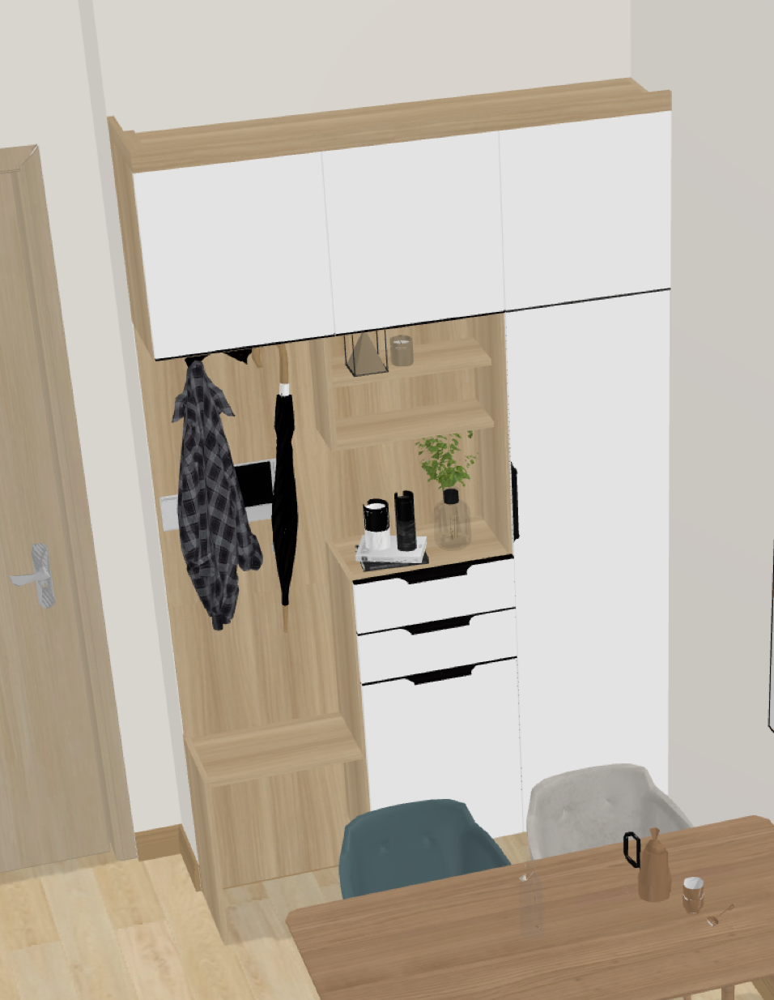

# Design

酷家樂，三維家，AutoCAD

酷家樂同三維家，都係非常簡單個裝修設計軟件，可以出平面圖，戶型圖，3D圖，渲染圖

呢d通常都係設計公司可以比客戶睇嘅

AutoCAD係確定最終尺寸之後，用來比工廠製作

# 1 渲染圖

> [link](https://yun.kujiale.com/design/3FO43CAL7XA8/show)

# 2 戶型圖，平面圖

# 3 3D圖

# 4 AutoCAD圖

呢d圖通常設計公司唔會比你，因為比咗你，就可以直接係工廠訂貨，設計公司收唔到錢啦

# 5 成品圖

