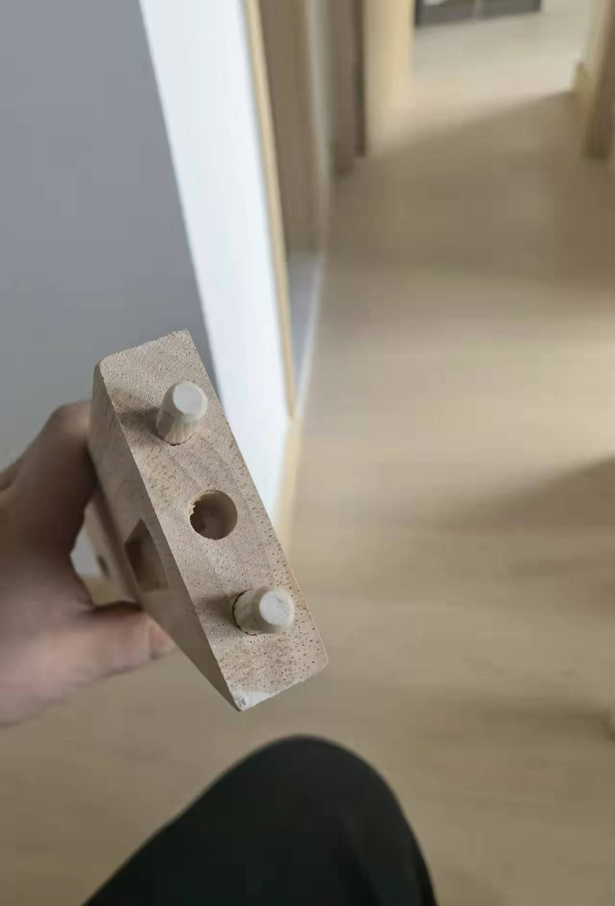
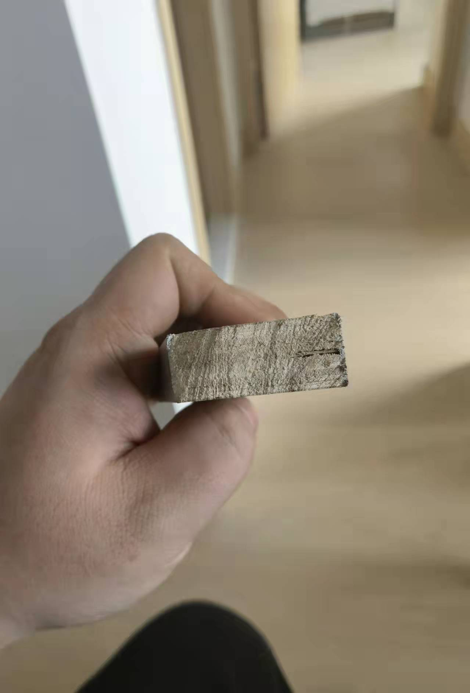
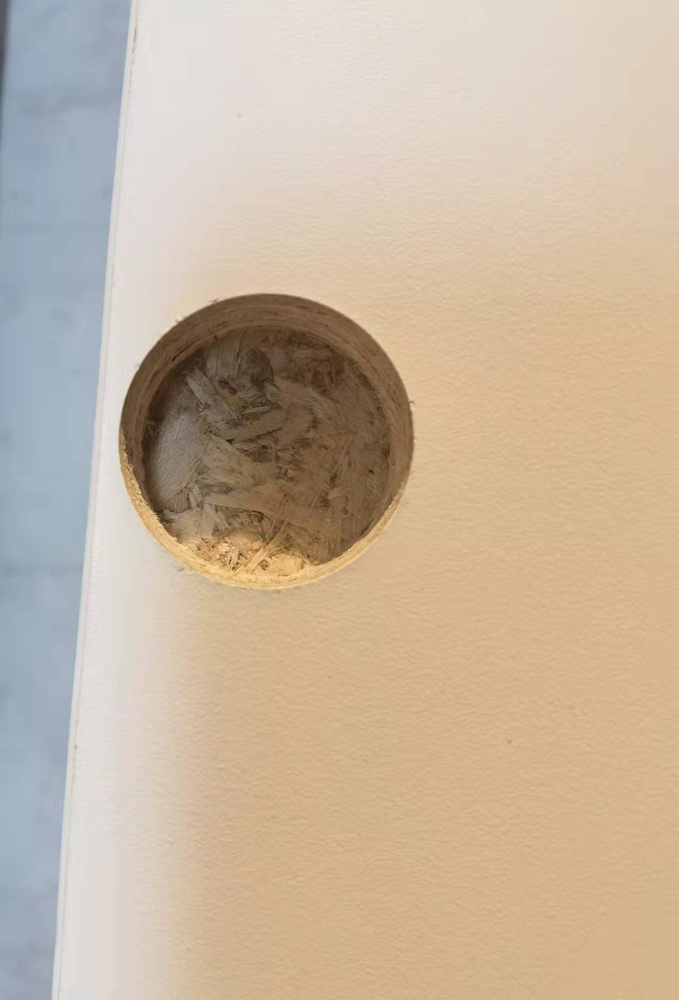

# Furniture

有好多街坊，都pm我關於全屋定制個問題。我係呢度統一答復一次，可能可以幫街坊慳返2成-4成錢。

# 一、材料

做傢私有四種材料，一種天然材料，三種人造材料

## 1 實木板

根據唔同木材，實木板分別好大，櫸木，松木，橡木，金絲楠木，因為材料唔同，耐用性由10年到幾百年唔等，紫禁城個金絲楠木傢私幾百年都好好d，但香港用金絲楠木係犯法，濕地公園即使死咗個金絲楠木，香港叫沉香，cut一段返屋企都犯法。櫸木個硬度好高，如果做一點圓潤個棱角或者雕花都唔得，實木個防潮防蟲性能大部分都差過人造板，除非非常好個木材。好處係天然，木材本身係冇甲醛，甲醛來自2個地方膠水同油漆。人造板係木屑，層板同膠水混合。

## 2 顆粒板

宜家，實惠買個成品傢私都係顆粒板，兩層夾板中間係木屑顆粒同膠水，硬度高，難加工，但是方便大廠流水線批量加工，現場開槽難，裝修師傅一般唔鐘意，但防潮防蟲都非常好，唔易變形

## 3 多層板

呢個最多人選，但都最混亂，因為呢個板有好多名稱，多層板，細芯板，大芯板，人造板，生態板，環保板，複合板，實木生態板，實木復合板，注意實木生態板，實木複合板唔係實木板，其實佢原本國家標準名稱叫E1多層板，E1，E2係國家環保標準《室内装饰装修材料有害物质限量10项强制性国家标准》，國家標準冇E0，但E0生態板係好多設計公司，淘寶定制自己封自己個名稱，好似米芝林3星，評獲3星之後，自己話自己係米芝林4星。小於1.5mg/L甲醛符合國家E1標準，小於1mg/L通常會自己叫自己E0。中國E1標準約等於歐盟E1，美國P1, 日本F3星。關於甲醛，即使你選擇最差個材料連E2都評選唔到個板材同油漆，如果可以做到通風2個月，屋內甲醛含量都低過啱啱裝修個E0材料。多層板好處係易現場加工，方便開槽再加工，防潮硬度不如顆粒板，硬度高，造型就難，但多層板可以做各種雕花造型，例如雕刻花紋，隱藏把手。

## 4 歐鬆板

唔係歐洲松木板，係OSB音譯，都係一種人造板，佢有所有顆粒板多層板個好處，壞處係比較貴。通常只做廚衛或者衣櫃櫃門，做櫃體比較浪費。有烤漆，噴漆，PET膚質感封面。做門板非常好，但佢比較厚，最櫃體未必好睇，通常最多人選擇用實木板，多層板，顆粒板做櫃體，用顆粒板或者歐鬆板做櫃門。但好多細廠只做一兩種材料。

# 二、成本

顆粒板《多層板《歐鬆板，800-2000人民幣每平方米不等，實木木材差距比較大，主要睇邊種木材。裝修設計公司，會用E1多層板報第一次價。通常比較平，我見到街坊send比我5萬-10萬。E0加錢，歐鬆板顆粒板櫃門加錢，特殊工藝加錢，把手加錢，鉸鏈加錢，櫃筒軌道加錢，封邊膠水加錢。到現場，香港裝修師傅會叫你冇用定制公司送個大陸膠水（15-20蚊一支），用香港進口膠水（40-50蚊一支），通常需要4-6支，師傅會賣比你。其實如果你對比兩個膠水，你會發現定制公司送個大陸膠水有成分表，有國標，包裝質地明顯好過所謂香港常用進口膠水，香港本地師傅會推薦一支菲律賓製造，一支產地唔明個三無產品，師傅話三無產品唔開裂唔變色，如果唔要師傅可能會黑面，我建議單獨比師傅茶錢，自己買膠水或者就用定制公司送d膠水。最好將所有會加錢個地方確定。例如櫃門把手可以自己淘寶，五金鉸鏈最貴最好個牌子奧地利百隆，淘寶25蚊一個，通常工廠批量定22蚊一個，比大家參考。

# 三、推薦

街坊搵好裝修設計公司，通常會比定金度尺5百-1千，然後報價，香港本地裝修設計公司，一般先比1-2成定金，可能出圖或者出圖前再比1-3成都有，收貨前比8-9成。我有幸搵到一間幫香港top5設計公司代工工廠。佢d所有木材都做，但設計師麻麻地，佢d係工廠，價格平。可以慳返1萬-7萬左右設計公司個錢，但設計全屋淘寶搵500-2000，香港本地搵2千-5千。通常裝修設計公司會收你定金或者度尺費，然後話免費出圖出設計，之後可能工廠報價1000一平米，佢d收你1500一平米，其實最尾都係工廠出貨工廠派師傅安裝，只要有設計度尺圖，工廠都可以做。我建議個做法，係搵裝修設計公司度尺出圖報價通常收500-1000定金，搵多幾間，然後同工廠直接報價比較一下，最多當跌咗度尺定金。我買過佢d歐鬆板，質量非常好。無論淘寶定google搵個裝修設計公司，都係出好圖，然後搵呢d工廠出貨。我推薦呢間佛山深圳有工廠，香港有安裝師傅，佢d報價係包括運輸安裝，唔包清潔。但佢d只係工廠，設計最好自己搵。我建議街坊可以自己搵裝修設計公司，或者淘寶全屋定制，度尺設計之後，可以send一份尺寸圖比我，叫呢間工廠報價，可能平1萬-4萬，如果ok，可以推工廠負責人微信比你，你自己定，佢冇whatsapp，只有微信，希望各位街坊裝到平靚正間房。