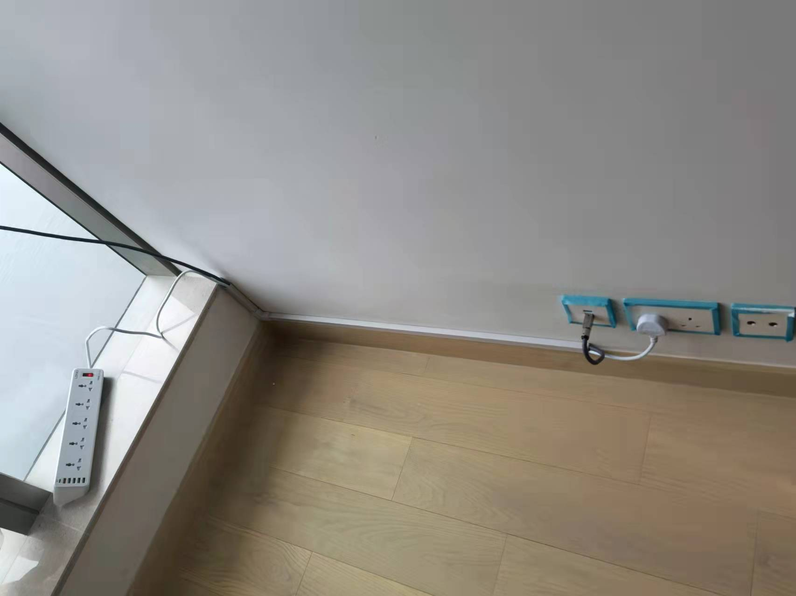
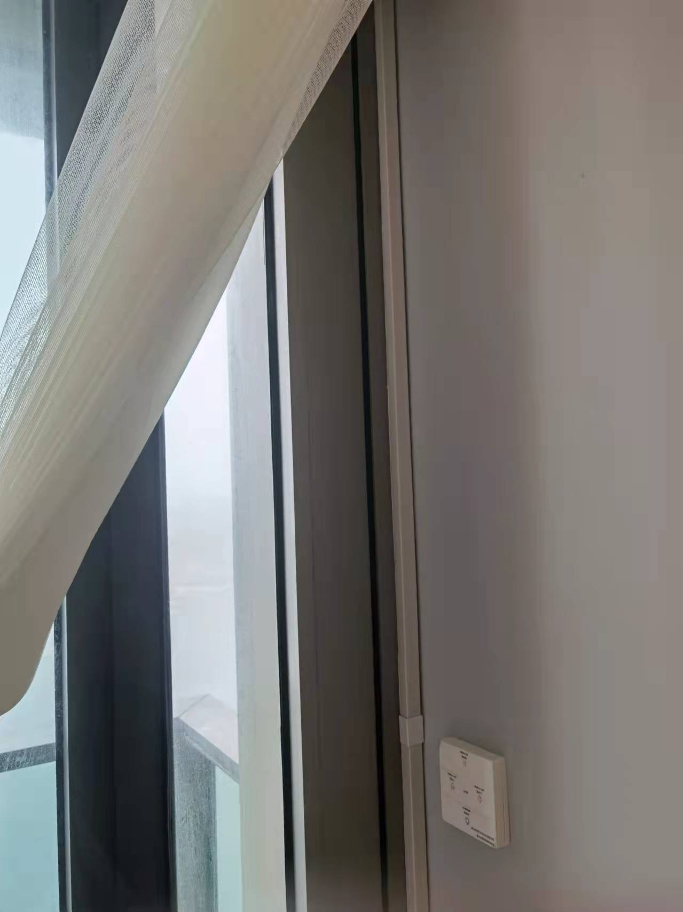
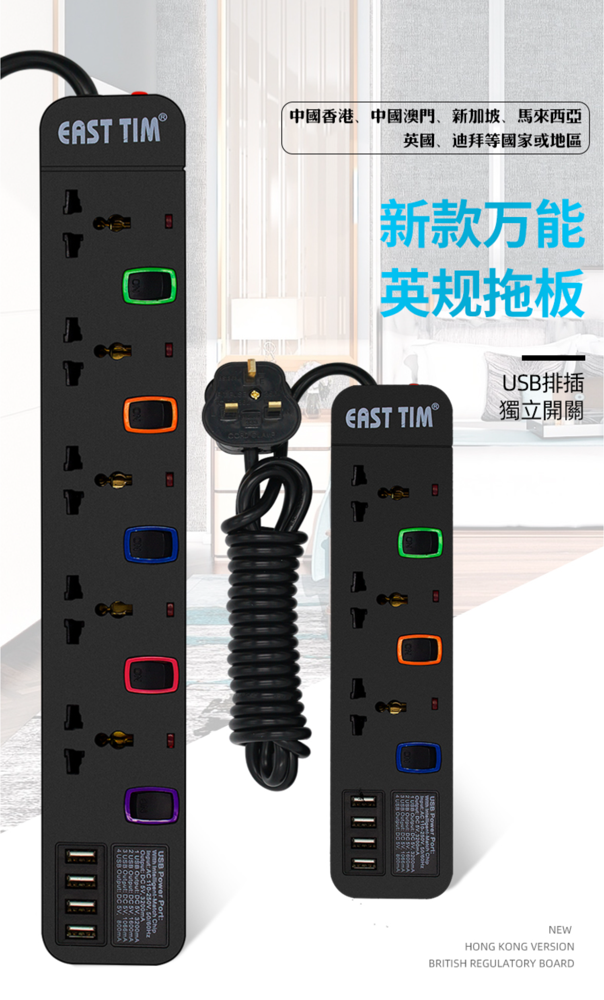
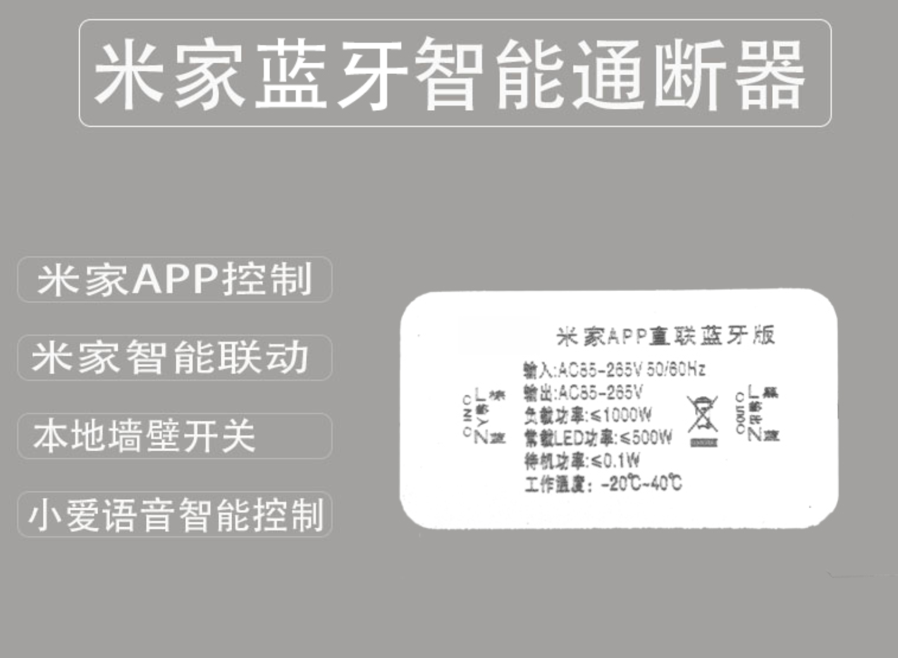
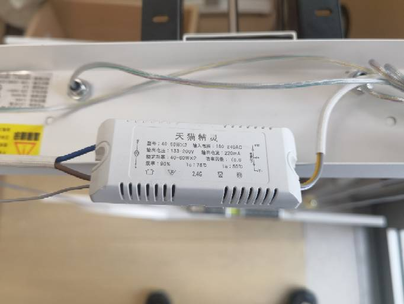
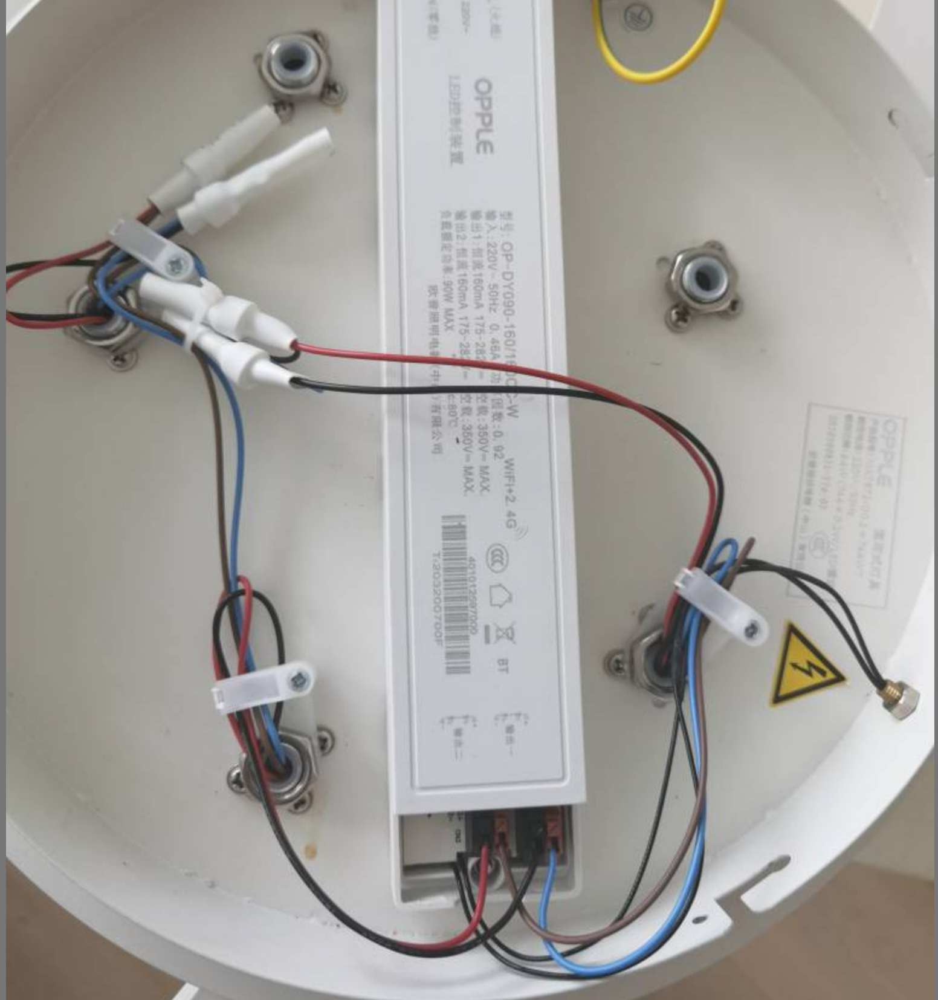
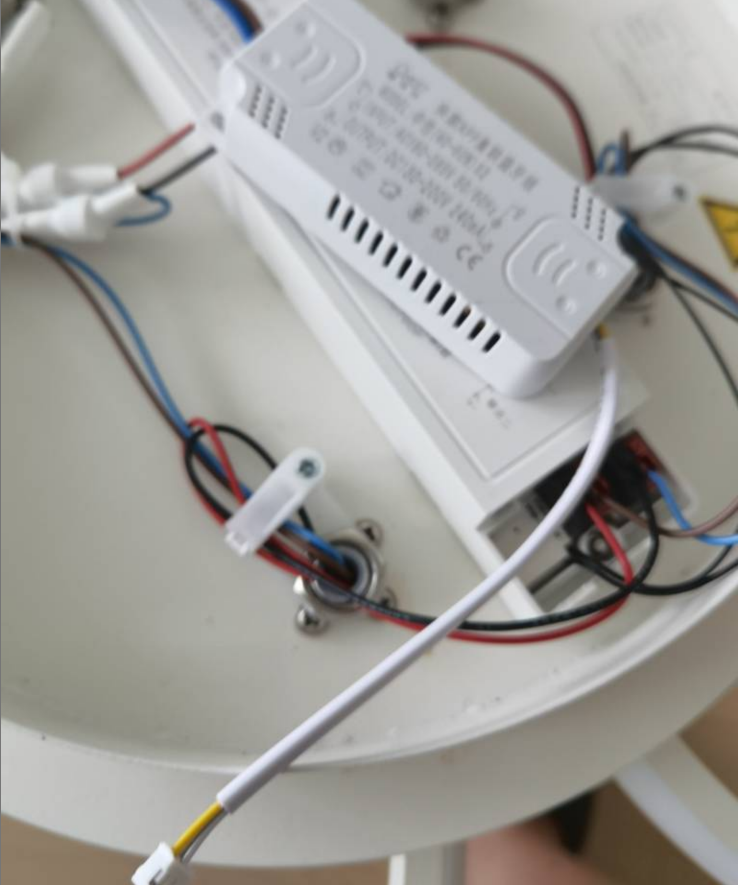
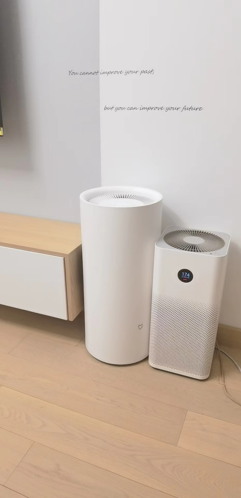
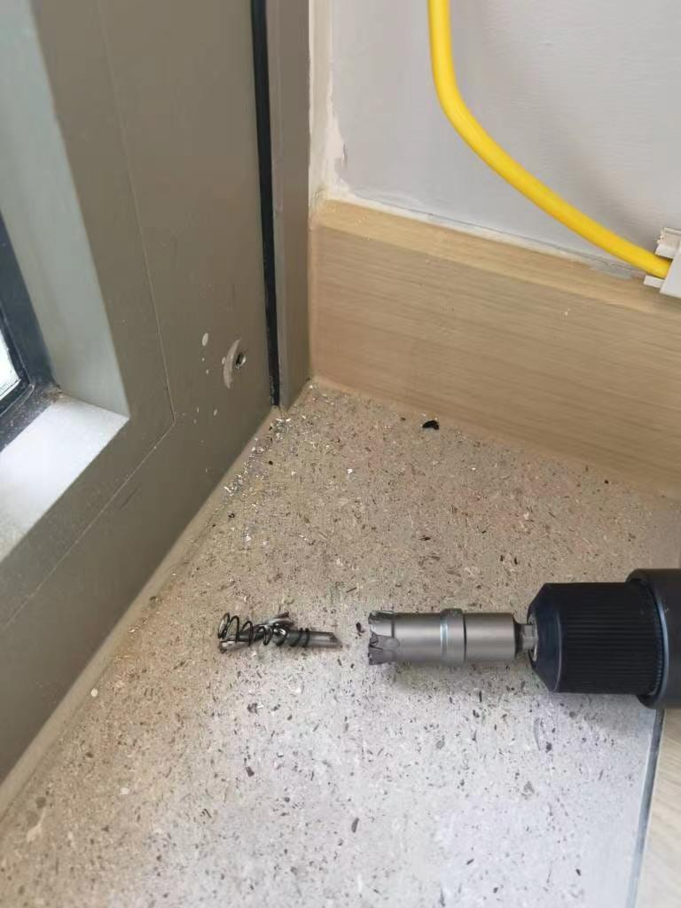

# 改裝

# 1 明線

由於傢私擺位關係，有地方要使用明線，有地方要改動插蘇位置

呢個係明線做法，網線加一條插線板

電動窗簾明線

> [購買link](https://item.taobao.com/item.htm?spm=a1z09.2.0.0.51e02e8dSaS7nj&id=621546804819&_u=n155thb243f)

推薦一個插線板，非常好用，大陸香港通用，有USB，有Type-C

> [購買link](https://item.taobao.com/item.htm?spm=a1z09.2.0.0.51e02e8dSaS7nj&id=619765307505&_u=n155thba3cc)

# 2 插蘇

改動插蘇，傢私背板開槽，第一種做法

第二種做法

<video src="https://sigmaxy.github.io/decoration/images/modify/2-2.mp4" controls="controls"></video>

# 3 普通吊燈改智能燈

雖然依家市場上智能吊燈都比較多款式，但是始終普通吊燈更加多，理論上任何普通吊燈只需要一個40蚊智能繼電器就可以變智能燈

> [購買link](https://item.taobao.com/item.htm?spm=a1z09.2.0.0.343f2e8dsiJxn9&id=610210019661&_u=m155thb8f3c)

打開普通吊燈背面，你會見到一個controller集成變壓器，有哋controller有智能，有哋有遙控

呢d唔總要，關鍵睇佢有幾條output，呢d係控制幾個單獨LED燈膽，一個LED燈膽需要一條火線，2條控制線（白光同暖光），火線可以並聯

如果見到4條或者5條output，只用講其中2-3條火線並聯，接入智能controller火線output，其他兩條控制線接駁智能controller白黃控制線。然後前內電源線接駁智能controller嘅input。

呢哋controller有好多平台，homekit，米家，華為，天貓。買對應自己常用個平台就ok，普通吊燈就變智能燈啦

# 4 除濕機水路

香港地濕氣好重，尤其我哋屋苑臨海，回南天可能80%以上濕氣，除濕機會係大多數人必須產品

但除濕機每日需要倒水，好麻煩，我個做法，係電視機櫃或者其他街坊係梳化下面加多一條排水管，係露台門框打個窿

就可以排水到露台，唔洗日日倒水啦，除濕機可以24小時開，或者用智能除濕機，濕度到一定先開

