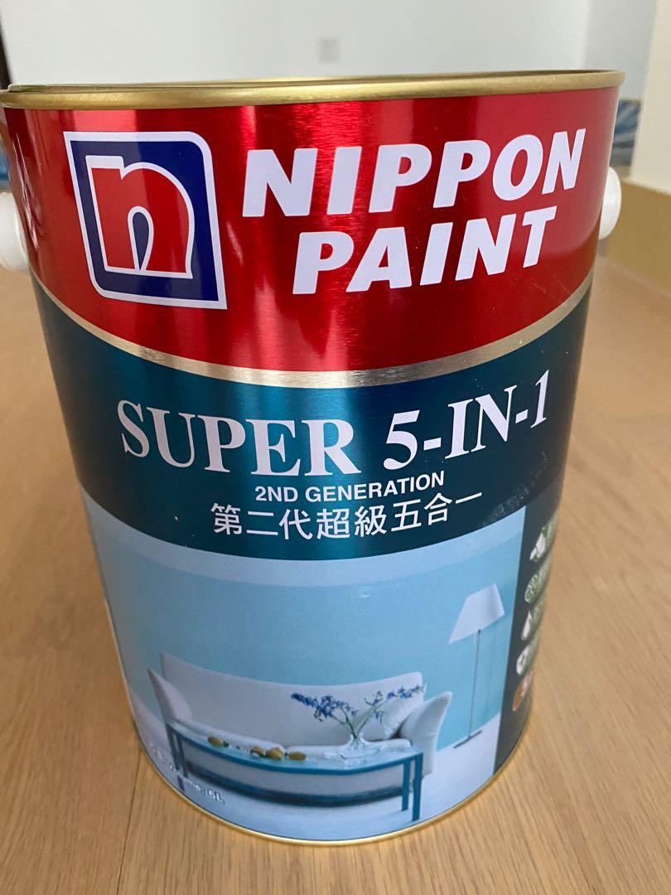
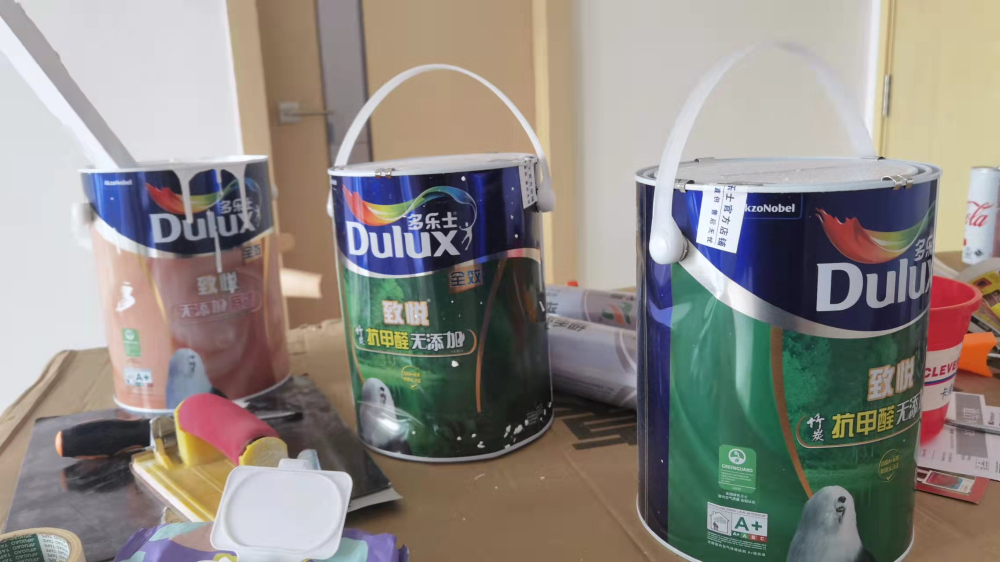
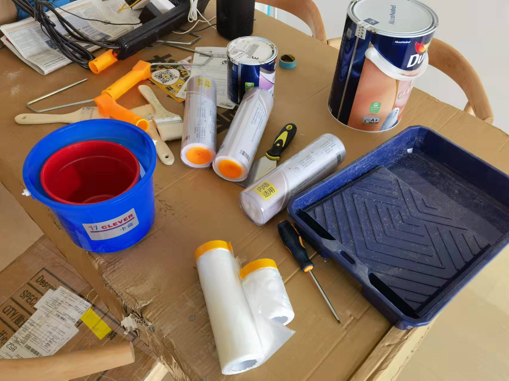
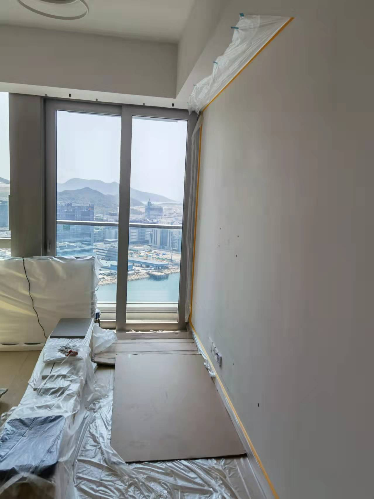
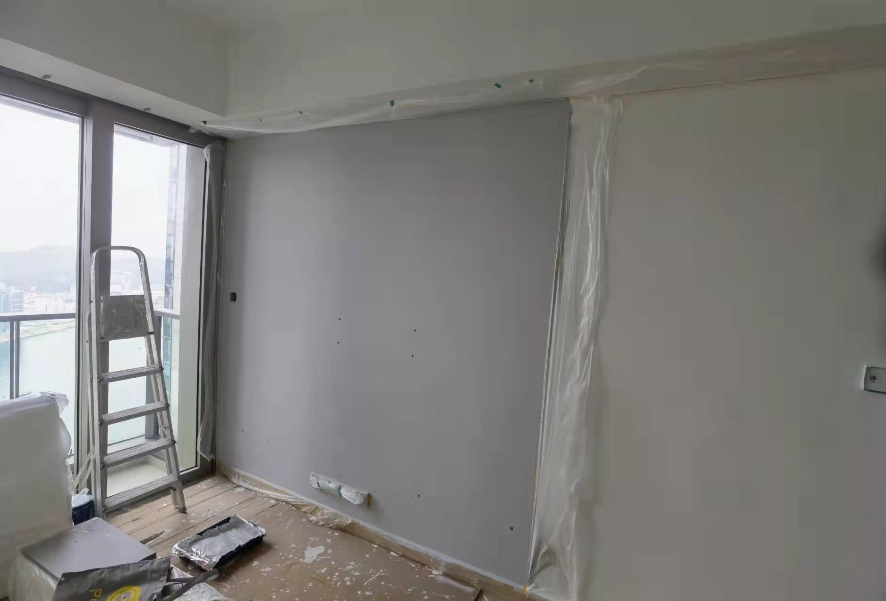
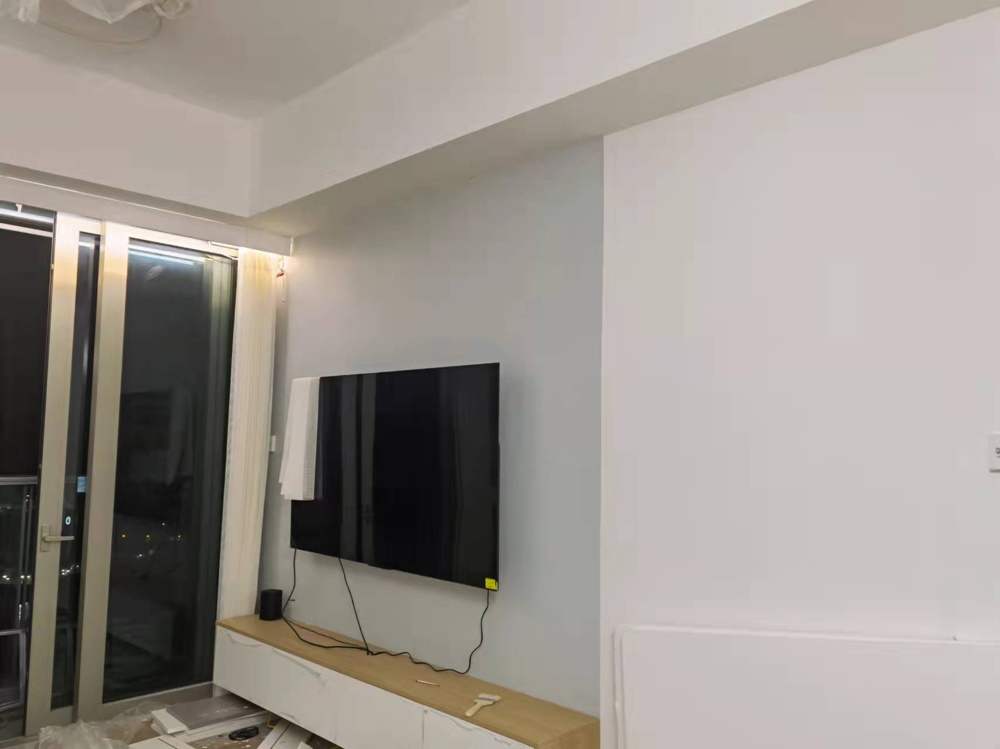
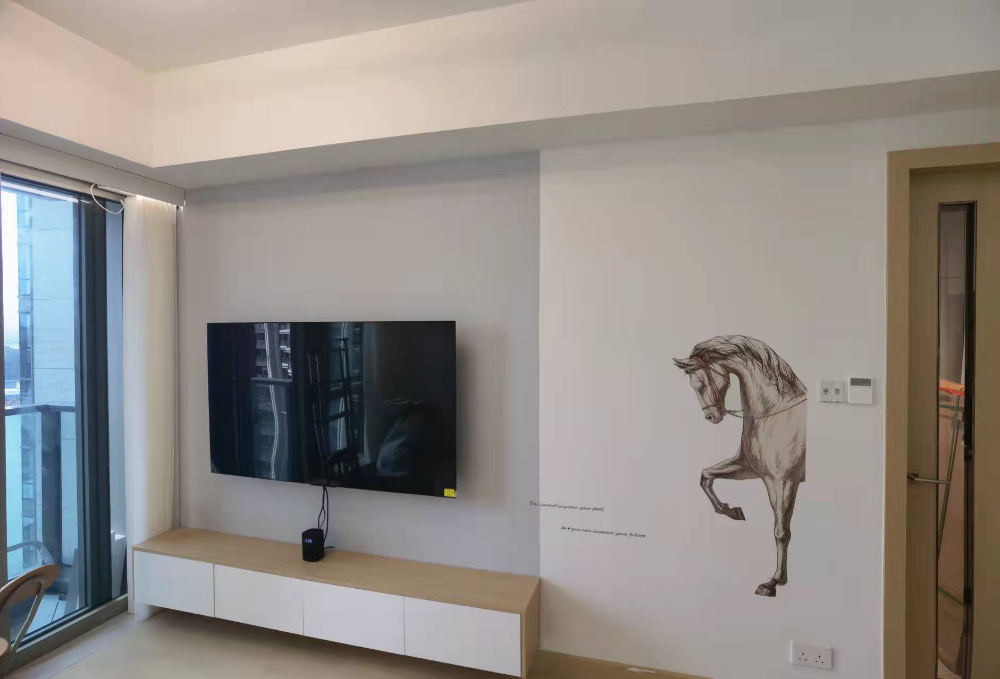
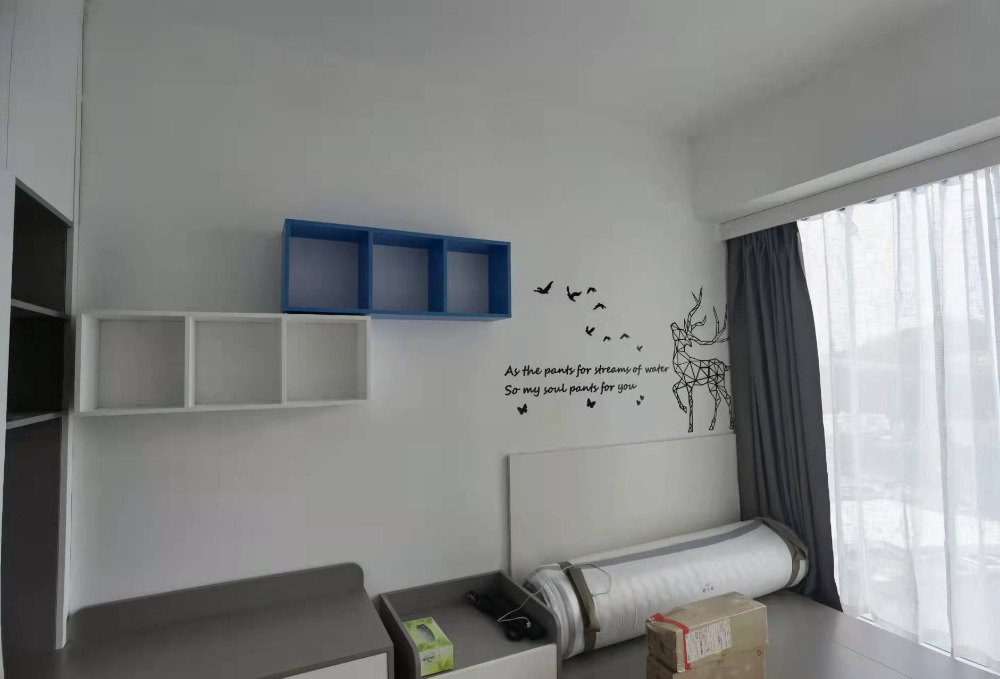

# 油漆

發展商用嘅油漆係Nippon白色，但油工做嘢时，有兩個問題，1，佢嘅用來攪拌油漆個桶，未必好乾淨，導致白色冇咁白，街坊自己買返同一隻牌子，同一款，油出來都會見到陰陽色。2，為咗做嘢快，油工會溝好多水，正常10%，油工會溝20-30%水，油嘅更快。

出邊搵過幾個油工報價，6千到2萬幾唔等，如果包料係9千到2萬幾。如果搵油工，我建議唔要包料，通常包料係呢隻

有兩個問題，1，好大味道，我試過佢中層一位街坊度幫佢度尺，見到油工用緊呢隻，好大味道，我自己買果隻反而冇乜味道。2，呢個五合一係唔分底漆，面漆，溝埋一起。底漆比較粘稠d，粘合度更高，面漆漆膜厚d放水性能更好。

聽完幾位油工報價，同街坊教學，最後決定自己買，自己油，細心d耐心d。

我買嘅係呢隻，多樂士，5L底漆10L面漆，一set，1299。粉紅色係底漆，另外兩罐係面漆，2房啱啱好。如果要買個街坊，同我聯絡，我買多咗，我仲有1套，買果時以為一套唔夠，買咗兩套，1299，marini免費送貨上門。

我買呢套係白色，如果想買其他顏色

> [購買link](https://detail.tmall.com/item.htm?id=653499668696&spm=a1z09.2.0.0.334c2e8droqljr&_u=l155thb9114&sku_properties=20138:34999)

工具

我全屋都油白色，只有電視墻灰色，因為照片睇唔出白色同原本油漆有乜分別（其實有分别，更加白），所以用特色墻舉例，先油底漆

第一遍面漆

第二遍面漆

最終效果

