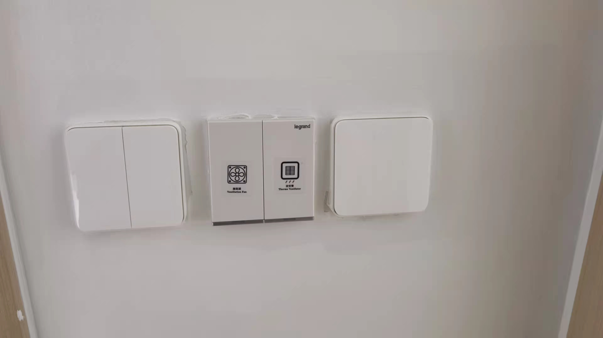
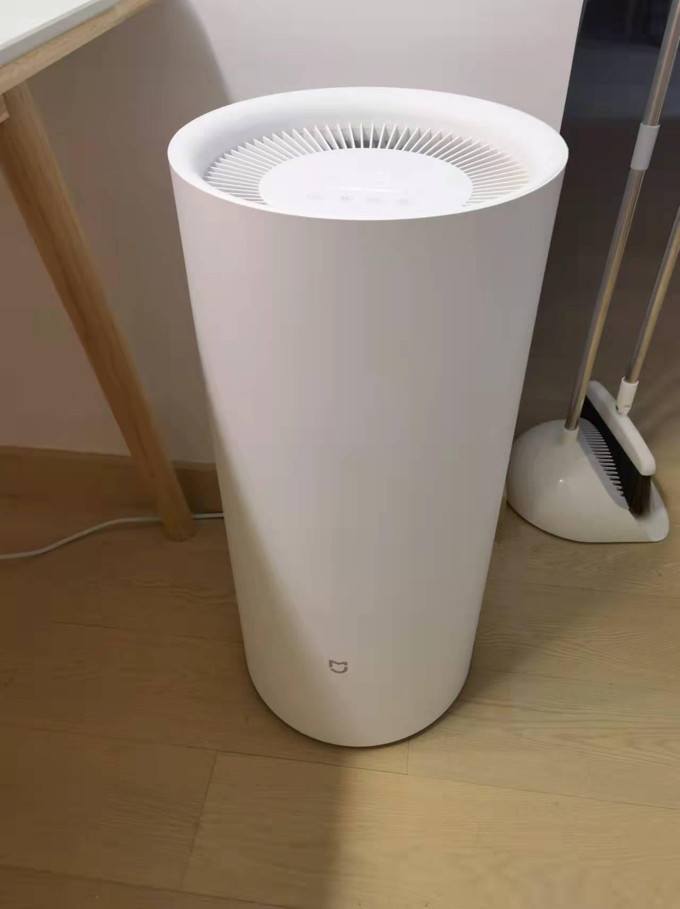

# 智能平台

市場上做智能平台好多，有5間比較大廠做，產品比價多，小米（米家），華為（AI Life），蘋果（HomeKit），三星（SmartThing），百度（天貓精靈），通常先選平台，選定平台，再開始選產品，因為唔同產品，可能僅僅support一兩個平台。例如小米同華為通常唔會support對家

宜家所有智能傢私有3种協議，wifi直駁，藍牙mesh，zigbee。wifi版最簡單，輸入wifi密碼就可以直接使用，方便智障人士使用，壞處係功耗高，通常需要接駁220v電源，電芯肯定帶唔郁，需要聯網先可以使用。藍牙mesh同zigbee都需要網關先可以使用，好處係呢兩樣都可以使用電芯，因為功耗低。分別係藍牙價錢平，zigbee設置比較複雜，要有一定網絡基礎知識，但zigbee可以做到本地策略，即係冇網絡亦可以使用。藍牙同zigbee設備如果需要雲端執行，需要hub即係網關，網關係一個將藍牙信號變成wifi信號嘅嘢，你手機都係一部，單獨買都係百幾蚊。有些設備自帶網關功能，例如隨便放一部手機係屋企，或者綠米智能開關，小米紅外音響play，呢d都係自帶網關可以比其他智能傢私使用嘅設備。

> [小米網關購買link](https://www.mi.com/buy/detail?product_id=11383&cfrom=search)

我主要產品選咗小米，小米主要做大陸，美國，印度市場，香港市場只有唔到5%嘅小米產品，同埋功能會少，例如小米電視，智能鎖，電鑽，智能窗簾等我推薦個產品，只有大陸，美國，印度先有的賣，香港小米旗艦店無。並非所有小米產品都值得推薦，我當初選小米，因為我有選擇困難症，如果淘寶search一下，成千個產品，小米通常只有黑白兩個產品二選一，同埋佢性價比高。我當初買咗2盞小米智能吸頂燈，而家後悔，因為小米智能吸頂燈，唔support凌動開關，我要重新49蚊買個智能凌動斷路器，先可以改裝到凌動智能效果，我遲d會係智能燈篇章，詳細講解。

小米電器轉大陸server係米家APP》我》設置》地區》選擇中國大陸。

我會將安裝步驟，圖片放下面

# 1 智能門鎖

我見到街坊有團購智能門鎖，都需要3800到5千幾唔等，可以網上自己購買，我來幫街坊免費安裝，以小米智能鎖為例，我買呢款有攝像頭，有password，有NFC，攝像頭電池同門鎖電池分開，有人臉標識。原價2199，天貓年貨節1999.

我覺得小米鎖設計好嘅地方，小米鎖有8粒電池加一個鋰電池，但只需要4粒就可以用。4粒冇電，手機通知，開始用另外4粒，鋰電池for攝像頭，可以延長鎖電時間。每次換4粒電池。如果冇電，有鎖匙，門外有typec充電口，可以直接用尿袋。但注意通常電子鎖包括小米都係C級鎖芯，如果用手機APP反鎖之後，屋內斷網，鎖匙又唔見，就冇得開鎖，只可能暴力破門啦。

關於鄰居投訴小米鎖自帶錄影，防盜眼，米家AI咁m解決法律問題，如果鄰居從你門口路過，唔會錄影，如果係門口逗留，做奇怪動作，先開始錄影

呢個係扣片

由左至右依次係原裝扣片，小米鎖送嘅扣片，我自己design嘅扣片，定制扣片係35蚊

扣片設計尺寸圖

呢個係導向片，由左至右依次係原裝導向片30200，小米默認送個導向片20240，自己淘宝購買導向片30240

> [智能鎖購買link](https://www.mi.com/buy/detail?product_id=14467&cfrom=search)

> [導向片、扣片購買link](https://item.taobao.com/item.htm?spm=a1z09.2.0.0.56432e8ddB7aT2&id=613821459277&_u=3155thb836c)

# 2 智能電視

電視差價最大，我呢款小米65吋OLED，8499，同樣以Samsung A65，豐澤2萬3，淘寶8千9，運費400幾。如果怕壞怕麻煩，建議豐澤，如果想慳錢，淘寶

<video src="https://sigmaxy.github.io/decoration/images/smart/2-1.mp4" controls="controls"></video>

我呢款小米65吋，有兩款，60Hz，六千幾，120Hz先8千幾

> [購買link](https://www.mi.com/buy/detail?product_id=14779)

# 3 智能開關

我買做4種只能開關，屏顯智能開關，可以顯示溫度濕度，控制冷氣抽濕機，單開雙開智能開關，無極調光智能開關，無線開關。全部單火版，因為我哋燈位開關冇零線，只可以買單火版，單火版唔可以用來控制大功率電器，零火版先可以，例如我的冷氣，浴室寶，煤氣等開關，都有零線，可以使用零火版.

小米單火開關，都可以轉無線開關使用，咁m理解，單火開關，開用實體開關鍵控制後面火線通斷，如果轉無線開關之後，佢就變成一個remote，可以設定智能場景，例如雙擊執行離家模式，熄燈熄冷氣，簡單點來講，智能開關本身只可以用繼電器控制後面火線嘅通斷，係APPs度轉無線開關之後，可以控制電腦，電視，窗簾等等。或者床頭放一個專門無線開關，單點一次，執行熄全屋燈光，執行智能冷氣方案，例如上半夜，冷氣開20度，後半夜冷氣溫度升高。

> [屏顯開關購買link](https://www.mi.com/buy/detail?product_id=13443&cfrom=search)

> [單雙開關購買link](https://www.mi.com/buy/detail?product_id=12950&cfrom=search)

> [無極調光購買link](https://www.mi.com/buy/detail?product_id=13244&cfrom=search)

> [無線開關購買link](https://www.mi.com/buy/detail?product_id=5006&cfrom=search)

<video src="https://sigmaxy.github.io/decoration/images/smart/4-1.mp4" controls="controls"></video>

# 4 智能吊燈

大家購買智能燈會詢問w數，其實w數唔準確。我個廳打橫2米68，灯around64w，led好少講w數，因為led通常可以由5瓦到100瓦調整。w數一定係唔準確，因為w數係電費單位，係代表你用幾多度電，以前都係燈膽，w數越大越明亮，LED唔係咁工作，LED個單位係色溫同流明，因為LED個明亮成都可以調節。即係佢可以做到5w到100w個燈膽明亮程度。你見到一d強光LED手電，佢先5w，但明亮程度大過500w個燈膽。但唔係所有人理解呢d單位含義，所以賣家會告訴你，呢個3000流明8000k色溫個LED等於100w，但是有機會佢可以做到5w到80，所以話w數唔準確，因為唔同單位。其實大家關心嘅係明亮程度同顏色，你以前都見過同樣100w個燈膽，慳電燈膽普通燈膽超明燈膽亮度都唔同，因為w數係電費。大家可以咁m做，去燈鋪睇一個你覺得明暗啱你使用個燈，問下色溫range幾多，流明range幾多，先去淘寶睇，就唔會選錯啦

餐廳位吊燈需要改位，補窿

<video src="https://user-images.githubusercontent.com/4843869/155232499-6d63feb1-40f1-4774-87e7-de894cca950a.mp4" controls="controls" style="max-width: 730px;">
</video>

<video src="https://user-images.githubusercontent.com/4843869/155232538-a4248fa9-ca7b-4927-a6ac-8cfe2878485a.mp4" controls="controls" style="max-width: 730px;">
</video>

> [購買link](https://www.mi.com/buy/detail?product_id=11041&cfrom=search)

# 5 智能晾衣架

小米晾衣架主機

安全繩纏繞位置

<video src="https://user-images.githubusercontent.com/4843869/155229777-62e5476b-83c1-4541-82a1-d1447313f326.mp4" controls="controls" style="max-width: 730px;">
</video>

<video src="https://user-images.githubusercontent.com/4843869/155229816-7a204033-2976-4cdf-8d75-8a8050327fea.mp4" controls="controls" style="max-width: 730px;">
</video>

> [購買link](https://www.mi.com/buy/detail?product_id=11041&cfrom=search)

# 6 智能窗簾

<video src="https://sigmaxy.github.io/decoration/images/smart/6-1.mp4" controls="controls"></video>

<video src="https://sigmaxy.github.io/decoration/images/smart/6-2.mp4" controls="controls"></video>

> [購買link](https://item.jd.com/100014743067.html)

# 7 智能門窗感應

<video src="https://user-images.githubusercontent.com/4843869/155229544-827a972b-a135-42cd-a0f4-214ac706d2ea.mp4" controls="controls" style="max-width: 730px;">
</video>

> [購買link](https://www.mi.com/buy/detail?product_id=12665&cfrom=search)

# 8 人體感應

有人係度自動開燈，2-5分鐘冇人，自動熄燈

> [購買link](https://www.mi.com/buy/detail?product_id=13175&cfrom=search)

# 9 溫濕度計

> [購買link](https://www.mi.com/buy/detail?product_id=14957&cfrom=search)

# 10 智能除濕機

我間房面海，濕度好大，正常75-85%，人體舒服嘅範圍係40-60，我設定濕度為50%，除濕機開4-6個鐘後會達到人體舒服範圍，之後用智能場景中溫濕度感應器來控制除濕機

> [購買link](https://www.mi.com/buy/detail?product_id=15196&cfrom=search)

# 11 掃地機器人

# 12 洗地機

# 13 智能門禁

原本PCB設計同電話

# 14 智能無線調色開關

> [購買link](https://www.xiaomiyoupin.com/detail?gid=107044&pid=43141)

# 15 智能冷氣

普通冷氣機變智能。成本係11+63+26=100蚊。有三個好處

1 可以手機控制，返到屋企前半個鐘先開冷氣，離開屋企可以自動熄機
2 可以睇到每日用電量，每個月冷氣用幾多度電
3 睡覺模式比較中意，如果開始睡覺頭4個鐘可以set22度，後4個鐘可以set25度，復合人體夜間體溫感受

首先準備呢3樣嘢工具，購買link係下面，一定要買大陸版插頭，主要因為呢個小米空調伴侶只有大陸版插頭，其實呢個小米空調伴侶就係一個繼電器加遙控器

係面板度打個窿

穿條線過去

拆咗原本個面板

見到6條線，3條1set零火地空調先，另一set零火地係power source。面板接駁power source零火地，插頭接駁空調零火地

裝完就係呢樣，可以手機控制啦

> [三厢插头購買link](https://detail.tmall.com/item.htm?id=619372660505&spm=a1z09.2.0.0.787f2e8dBPAj5R&_u=h155thb10ee)

> [米家空調伴侶2購買link](https://item.taobao.com/item.htm?spm=a1z09.2.0.0.787f2e8dBPAj5R&id=629762557704&_u=h155thb2b10)

> [插座面板購買link](https://detail.tmall.com/item.htm?id=624093888974&spm=a1z09.2.0.0.787f2e8dBPAj5R&_u=h155thb9428)

# 16 智能夢幻簾

智能夢幻簾由路軌，夢幻簾，窗簾盒，智能燈帶組成，路軌同夢幻簾係下面，燈帶我啱啱收到貨就後悔啦，因為3月頭小米出咗小米智能燈帶，感覺更加平，更加好。窗簾盒係我用傢私剩返的板材自己起個出來，用L金屬固定天花，因為唔夠長，用木工3合一接駁多一款短板，遲滴做下油漆就睇唔出啦。

<video src="https://sigmaxy.github.io/decoration/images/smart/16-1.mp4" controls="controls"></video>

> [購買link](https://detail.tmall.com/item.htm?id=641941821196&spm=a1z09.2.0.0.787f2e8dBPAj5R&_u=h155thb883d)

# 17 智能燈帶

燈帶主要分為兩種瞬開瞬關燈帶，可以控制顏色，流水追光燈帶。我呢款係流水燈帶，可以控制流水速度。

智能燈帶同夢幻簾係米家或者蘋果Homekit設置智能場景，夜晚閂窗簾果時自己動開燈或者關閉。

> [購買link](https://detail.tmall.com/item.htm?id=632540864278&spm=a1z09.2.0.0.787f2e8dBPAj5R&_u=h155thb9c1b&sku_properties=13381687:10122;122276201:10122)

# 18 智能燒水爐

可以保溫，可以定時

> [購買link](https://item.taobao.com/item.htm?spm=a1z09.2.0.0.7ac82e8dr4nNPb&id=643739864890&_u=i155thb2de8)

# 智能場景

| 场景 | 条件 | 执行 |
| ------ | ------ | ------ |
| 离开家 | 锁门 | 关灯，清扫，开窗一小时，关闭空调电视 |
| 回家家 | 指纹开锁 | 开灯，停止清扫，关窗帘，打开空调电视 |
| 影音模式 | 语音指令 | 关灯，关窗帘，开灯带，开电视 |
| 早起 | 闹钟响 | 开窗帘，早餐机，开厕所灯 |
| 睡觉 | 语音指令 | 关灯，抽湿机，空气净化器睡眠模式，空调睡眠模式，关窗帘 |
| 进入厨房 | 人体感应 | 开灯 |
| 离开厨房厨房 | 人体感应 | 关灯 |
| 进入卫生间 | 人体感应 | 开灯 |
| 离开厨卫 | 人体感应 | 关灯 |
| 抽湿控温 | 温湿度感应 | 除湿机，空调联动 |
| 下雨 | 水浸感应 | 降低晾衣架，关窗 |
| 监控 | 本人不在家 | 开启监控|
| 监控 | 陌生人在门口 | 开启监控|

