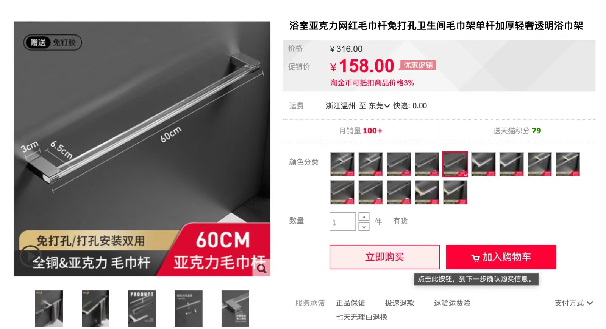
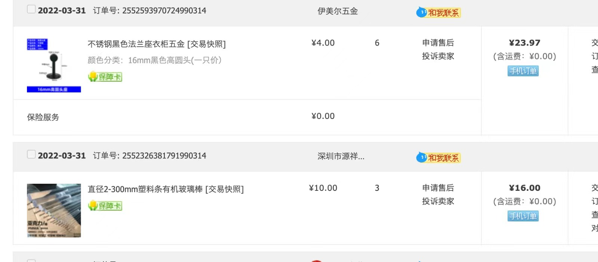
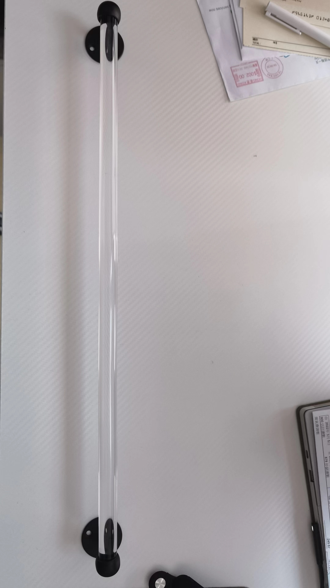
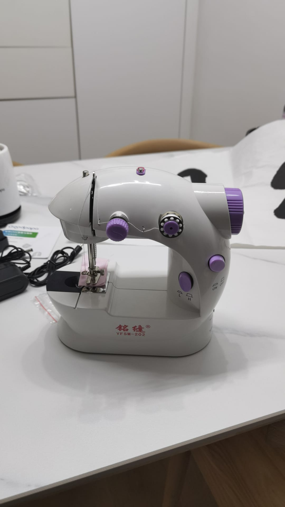

# 好物推薦

# 1 毛巾架

有街坊問我點樣搵到平靚正個淘寶物件
例如我想要個毛巾架，但好唔容易搵到一個，佢竟然要158蚊，如果我要3個，竟然需要480蚊，睇下佢個材料係不鏽鋼同壓亞加力

於是單獨搵不鏽鋼底座4蚊一個，同亞加力棒8蚊一根，3mm-200mm都有

於是40蚊，我有3個毛巾架啦

# 2 縫紉機

可以直接買布，買絲綢，自己車窗簾，抱枕

> [購買link](https://item.taobao.com/item.htm?spm=a1z09.2.0.0.7ac82e8dr4nNPb&id=553108724121&_u=i155thb1219)

